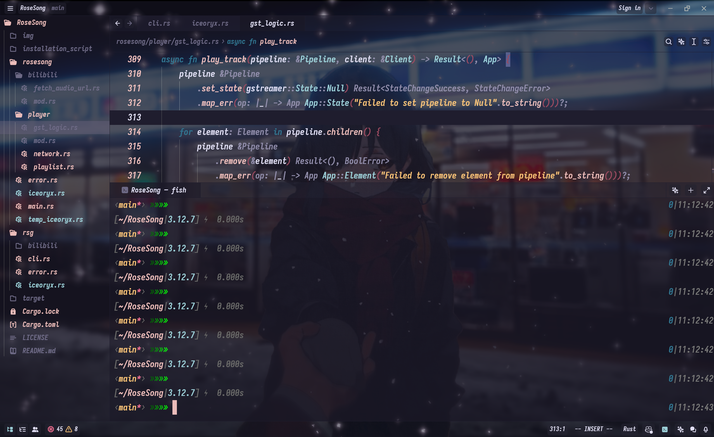

# rose-pine-zed-transparent
Transparency settings for Rosé Pine theme in zed
## Renderings

    

    

## Usage
Place `theme.json` into `.config/zed/theme` folder

Set `"theme": "Rosé Pine"` in `.config/zed/settings.json`

Enjoy the transparent Rosé Pine theme in zed
